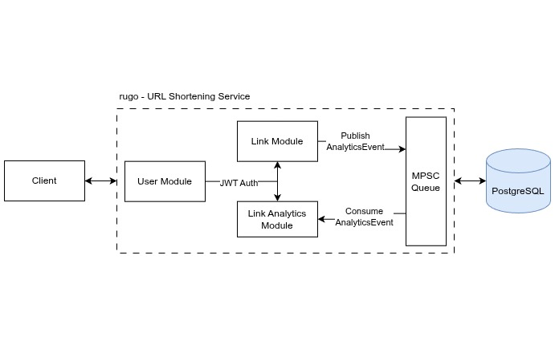

# 🦀 rugo

Rugo is a personal portfolio project designed to demonstrate the implementation of Clean Architecture principles using the Rust programming language and the Axum web framework. It serves as a functional URL shortening service with a focus on maintainable, testable, and decoupled code.



## ✨ Features

- 🔐 Secure Authentication: User lifecycle management with JWT-based sessions and refresh token rotation.
- 🛡️ Password Protected Links: Optional security for redirections; requires a valid password via query parameter.
- 📉 Click Limits: Support for "one-time" or limited-use links that expire after a set number of clicks.
- 🏷️ Custom Short Codes: Ability to define custom slugs for branded or memorable links.
- 📊 Link Analytics: Private tracking of click counts and link status for authenticated owners.
- 🛠️ Robust Validation: Domain-driven validation to ensure data integrity before reaching the persistence layer.

## 🛠️ Tech Stack

- Language: Rust
- Web Framework: Axum
- Documentation: Utoipa (OpenAPI)
- Database: PostgreSQL with SQLx
- Auth: JWT (JSON Web Tokens)

## 📖 API Reference

### 👤 Users & Authentication

| Method   | Endpoint                 | Description                                     |
| :------- | :----------------------- | :---------------------------------------------- |
| **POST** | `/api/v1/users/register` | Register a new account.                         |
| **POST** | `/api/v1/users/login`    | Authenticate and receive access/refresh tokens. |
| **POST** | `/api/v1/users/refresh`  | Rotate tokens using a valid refresh session.    |
| **GET**  | `/api/v1/users/me`       | Fetch current user profile.                     |
| **POST** | `/api/v1/users/logout`   | Revoke the current session.                     |

### 🔗 Link Management

| Method   | Endpoint                       | Description                                            |
| :------- | :----------------------------- | :----------------------------------------------------- |
| **POST** | `/api/v1/links`                | Create a shortened link with optional password/limits. |
| **GET**  | `/api/v1/links/me`             | List all links created by the current user.            |
| **GET**  | `/api/v1/links/{id}/analytics` | Get click stats for a specific link.                   |

### 🚀 Redirection Logic

| Method  | Endpoint                     | Behavior                            |
| :------ | :--------------------------- | :---------------------------------- |
| **GET** | `/{short_code}`              | Direct entry point for redirection. |
| **GET** | `/api/v1/links/{short_code}` | API entry point for redirection.    |

#### Redirection Status Codes

307 Temporary Redirect: Success.

401 Unauthorized: Password required or incorrect.

403 Forbidden: Click limit reached or link manually disabled.

410 Gone: Link has reached its expiration timestamp.

404 Not Found: Short code does not exist.

## 🚦 Getting Started

### 1. Environment Configuration

Copy the example configuration and adjust the values to match your local setup.

```bash
cp .env.example .env
```

### 2. Infrastructure & Database

Rugo uses Docker to manage the database and SQLx for the schema. You will need the Rust toolchain installed (or use `nix develop` to enter the flake-provided shell).

```bash
docker compose up -d
sqlx database create
```

### 3. Execution

Launch the application. The service is configured to run migrations automatically on startup.

```bash
cargo run
```

#### Documentation

Once the server is running, the interactive Swagger UI is available at /swagger-ui.

## 🛡️ Security Implementation

- Password Hashing: Implements Argon2id for secure user and link credential storage.
- Token Safety: Implements refresh token reuse detection and revocation.
- Layered Error Handling: Maps internal domain errors to appropriate HTTP status codes (401, 403, 404, 410).

## 📄 License

This project is licensed under the MIT License.
